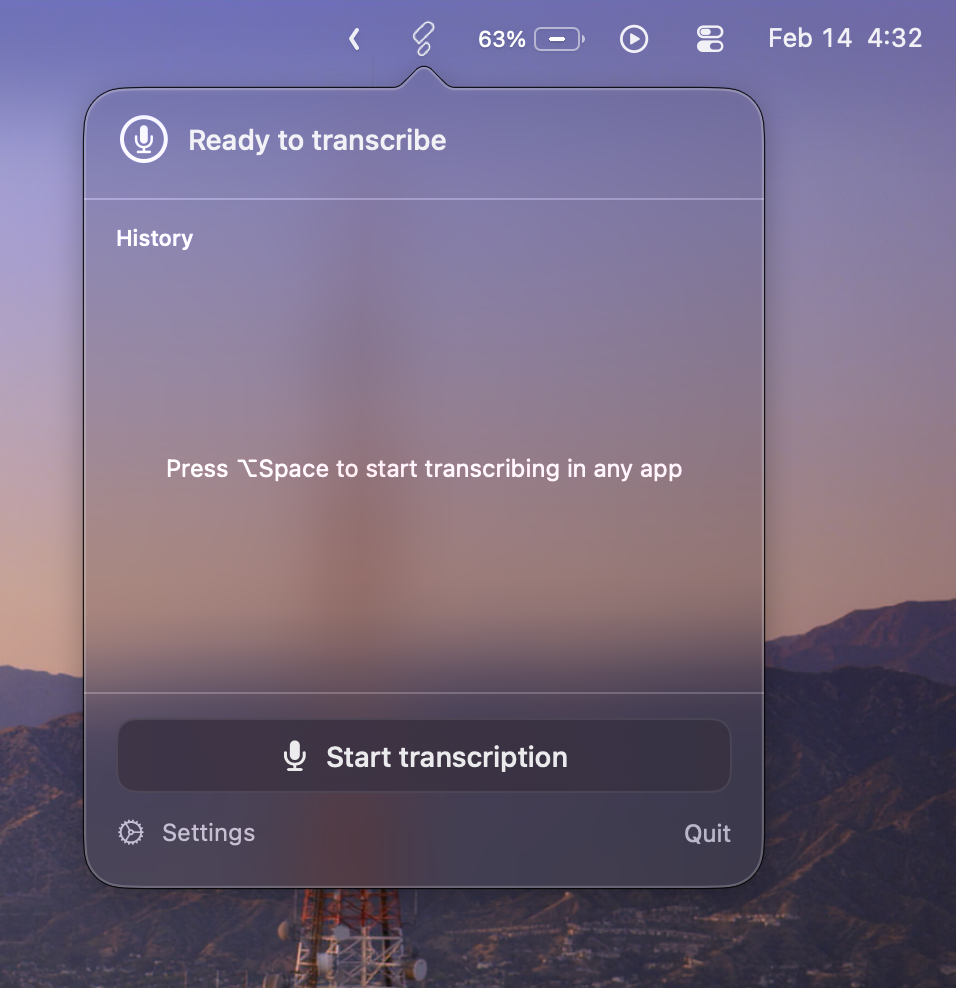
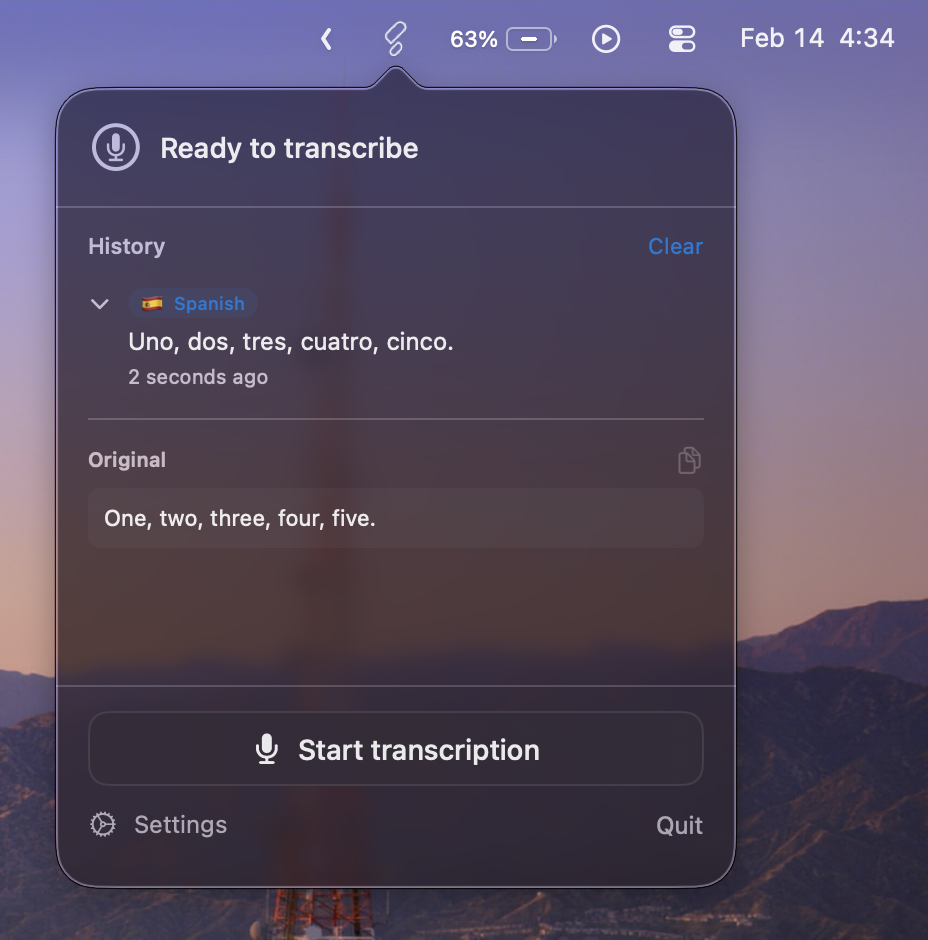
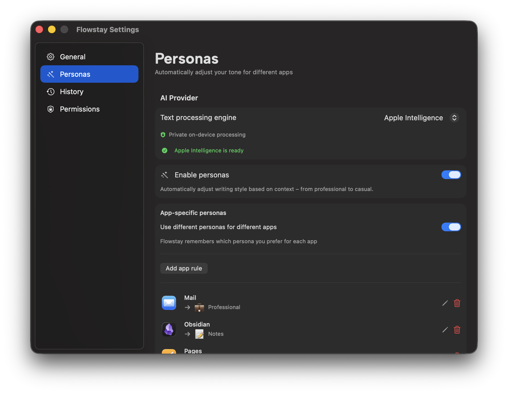

# Flowstay

<p align="center">
  
</p>

Flowstay is a macOS menu bar app for fast transcription with smart workflows, running on [FluidAudio](https://github.com/FluidInference/FluidAudio).

## Screenshots

### Menu Bar Ready State


### Transcribed State


### Personas Settings


## Requirements

- macOS 15+
- Xcode 15+ (or Swift 6.2 toolchain)

## Build

```bash
swift build -c release
```

## Run

```bash
./build_app.sh
open /Applications/Flowstay.app
```

## Tests

```bash
swift test
```

## Permissions

Flowstay requires:

- Microphone access
- Accessibility access (for system-wide shortcuts)

## AI Providers

Flowstay personas support:

- Apple Intelligence (on-device, macOS 26+)
- OpenRouter (cloud, OAuth connection)
- Claude Code (local CLI integration)

### Claude Code + Pro/Max subscriptions

When you pick `Claude Code (experimental)` in Settings, Flowstay invokes your locally installed `claude` CLI.

- If Claude Code is logged in with your Claude account, usage follows that Claude plan (including Pro/Max limits).
- If Claude Code is configured with `ANTHROPIC_API_KEY`, usage is billed against Anthropic API credits instead.
- Flowstay uses Claude Code CLI auth for this provider (not Agent SDK API-key auth), so users can keep their existing Claude subscription session.
- You can choose the Claude model (`haiku`, `sonnet`, `opus`) in Personas settings.
- `Strict rewrite` mode disables tools and enforces structured rewrite output; it is best-effort and can still fail on some prompts.
- `Assistant (experimental)` can answer requests directly instead of just rewriting transcript text.
- Setup: install Claude Code, then run `claude login` in Terminal.

## Troubleshooting

- If the app fails to start, check Console.app for crashes referencing NSWindow collection behavior.
- If transcription fails, verify microphone permission and model download status.

## License

Apache-2.0. See `LICENSE` and `NOTICE`.
